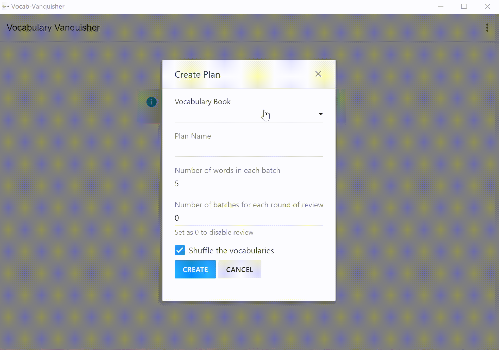

# Vocab-Vanquisher

Vocabulary builder simulating using a textbook and tear-it-down methodology.

- [Vocab-Vanquisher](#vocab-vanquisher)
  - [Demo](#demo)
  - [Installation](#installation)
    - [Windows Executable](#windows-executable)
    - [Run from Source](#run-from-source)
  - [Methodology](#methodology)
  - [Road Map](#road-map)

## Demo



## Installation

### Windows Executable

Download the [release](https://github.com/Vopaaz/Vocab-Vanquisher/releases/tag/v0.2.1).

### Run from Source

```bash
git clone git@github.com:Vopaaz/Vocab-Vanquisher.git
cd Vocab-Vanquisher
npm install
npm run electron:serve
```

## Methodology

Most vocabulary builder applications today ask you to choose
the definition from several options.
Personally I consider this inefficient, as in most cases it is just
the impression of the (Chinese) definition that leads you to the correct answer,
rather than successfully reciting the vocabulary itself.

The most effective way, from my perspective, is still using a textbook-ish approach.
You select a batch of words, look at their definitions then cover them with your hand
or a piece of paper.
You try to recap their meaning in your mind, then check whether you are correct.
After repeating this for several times, you move on to the next batch.

This is the same thing this app is achieving.

One problem with the textbook, however,
is that you tend to get stuck at "Vocabulary List 1" forever,
if you want to make sure you recited every words in it before you move on.
One of my friends introduced a methodology to me.
The idea is to tear every page down after you recite them once,
and keep going until the whole textbook is in the trash bin.
Then, buy a new one and start over again.
This methodology prevent you from being troubled by those ridiculously hard words and
forces you to move on.
With several rounds of reading (several textbooks in the bin),
you should remember most of the words there.

Admittedly it wastes a lot of resource and money so that's why
I created this app.
Moreover I think a little bit of reviewing may also be helpful,
as long as you cannot do "random access", which get you stuck.
So it is also provided as an option.

## Road Map

This is just a simple and crude project initialized for personal use.
If anyone is interested please star or issue, then I will (hopefully) work on:
- Theme, background, and other appearance improvement
- More vocabulary textbook
- User-uploaded textbook
- Other interesting ideas

